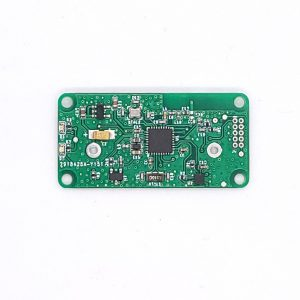
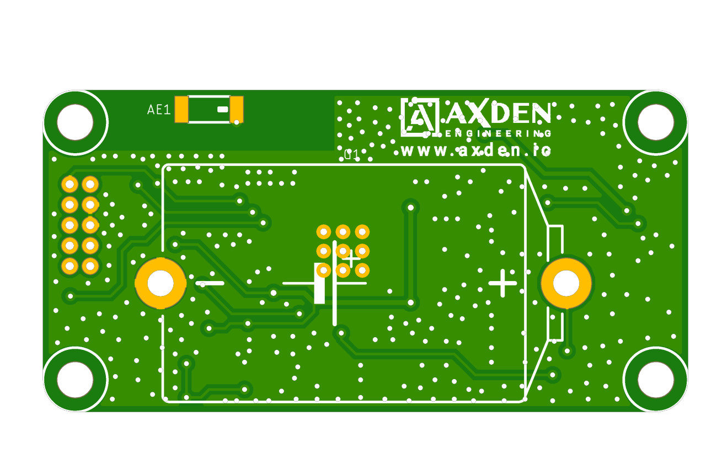
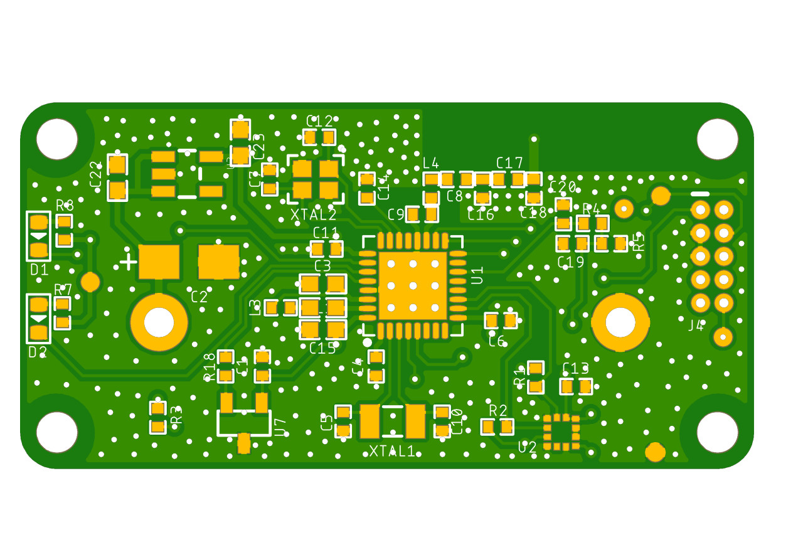

# 3-Axis Bluetooth Motion Tracker


<br>

----

3-Axis Bluetooth Motion Tracker collects key information required for Motion Tracker such as acceleration and temperature and transmits it using Bluetooth communication.
<br>
This is an example provided to quickly test various service scenarios that require Android, iOS, and Gateway communication.
<br>

----

Device can be purchased from the Naver Smart Store.
<br>

[Purchase Link : naver smart store](https://smartstore.naver.com/axden)
<br>
<br>

You can purchase it by contacting sales@axden.io

----

### Key feature and functions

MCU | Description
:-------------------------:|:-------------------------:
NRF52811 | Bluetooth SoC

센서 | Description
:-------------------------:|:-------------------------:
KXTJ3 | 3 Axis Accelerometer
Si7201 | Hall Sensor
NTCG104BH103JT1 | NTC Temperature Sensor
Battery | 1/2 AA Battery 1200mAh

<br>

It is a motion tracker capable of BLE communication.
<br>

BLE communication is possible using NRF52811 SoC
<br>

It can be turned on and off using Si7201 Hall sensor and magnet.
<br>

The acceleration values are collected using the KXTJ3 sensor.
<br>

The temperature value is collected using NTC.
<br>

It operates for 5 years using a battery.
<br>

----

### Note

This program is not suitable for mass production and commercialization as an example program.
<br>

B2B customers should contact development@axden.io.
<br>

For B2B customers, we develop firmware optimized for customers' purposes, such as low power, stabilization, and communication with gateways, for free.
<br>

<table>
  <tr align="center">
    <td>Top</td>
    <td>Bottom</td>
  </tr>
  <tr align="center">
    <td></td>
    <td></td>
  </tr>
</table>

Pinmap can be found in the file ```board_define.h``` .
<br>

```

#define BATTERY_LEVEL_ADC 4 //AIN2
#define NTC_ADC 5 //AIN3
#define NTC_VCC_GPIO 18

#define LED_RED_GPIO 28
#define LED_BLUE_GPIO 25

#define I2C_SDA_GPIO 12
#define I2C_SCL_GPIO 14

#define HALL_INPUT_GPIO 30


```

<br>

Works with SoftDevice S112 v7.2.0, provided with SDK 17.1.0.
<br>

To compile it, clone the repository in the [SDK]/examples/ble_peripheral folder.
